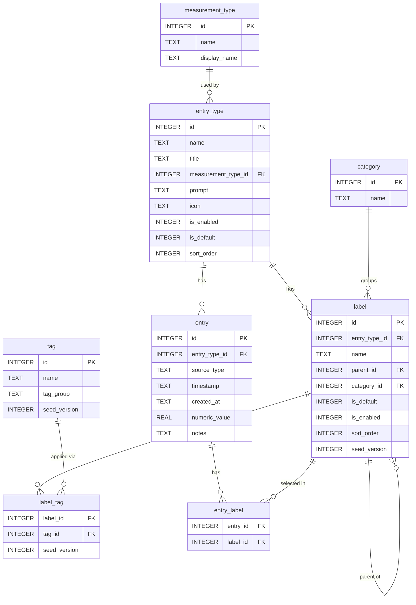

# Haven Database Schema

The source of truth is `lib/db/migrations/`. The ER diagram below reflects what is currently implemented.

## Planned tables (not yet implemented)

| Table | Purpose |
|-------|---------|
| `issue` | User-defined named health concern (e.g. "Carpal tunnel") for grouping physical state entries over time |
| `entry_issue` | Join table linking entries to tracked issues |
| `anchor_activity` | Grounding activity suggestions with effort tracking |
| `anchor_tag` | Join table linking anchor activities to tags |

## Notes on specific columns

**entry.source_type** — `"log"` (timestamped, in-the-moment) or `"reflect"` (end-of-day, date-associated). Reflect mode UI is deferred; the field is captured now to avoid a future migration.

**entry.numeric_value** — used for: hours (sleep), oz/ml (hydration), energy 0–5 (Physical entries with Energy label), severity 1–5 (Physical entries with body area/whole body labels).

**label.parent_id** — self-referencing FK enabling two-level hierarchies: valence → specific emotions (Emotion), body area → symptoms/states (Physical).

**label.seed_version** — incremented when new seed rows are introduced in an app update. On app open, only rows where `seed_version > last_applied_version` are inserted (via `INSERT OR IGNORE`), so user-deleted associations are never re-applied.

**entry_type.measurement_type_id** — drives which logging form is shown. Types: `numeric` (sleep, hydration), `label_select` (food, emotion, activity), `label_select_severity` (physical).
