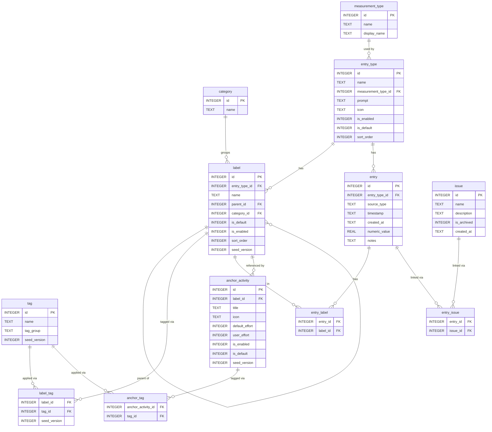

# Haven Database Schema

## Additional Tables

### issue
User-defined named health concern for grouping physical state entries over time (e.g. "Carpal tunnel", "Gut / celiac").

| Column | Type | Notes |
|---|---|---|
| id | INTEGER PK | |
| name | TEXT NOT NULL | e.g. "Carpal tunnel" |
| description | TEXT | optional |
| is_archived | INTEGER (bool) | hidden when no longer being tracked |
| created_at | TEXT NOT NULL | ISO 8601 |

### entry_issue
Join table linking entries to tracked issues.

| Column | Type | Notes |
|---|---|---|
| entry_id | INTEGER FK | → entry |
| issue_id | INTEGER FK | → issue |
| PRIMARY KEY | (entry_id, issue_id) | composite |

## Notes on Specific Columns

**entry.source_type** — `"log"` (timestamped, in-the-moment) or `"reflect"` (end-of-day, date-associated). Reflect mode UI is deferred; the field is captured now to avoid a future migration.

**entry.numeric_value** — used for: hours (sleep), oz/ml (hydration), energy 0–5 (Physical entries with Energy label), severity 1–5 (Physical entries with body area/whole body labels).

**label.parent_id** — self-referencing FK enabling two-level hierarchies: valence → specific emotions (Emotion), body area → symptoms/states (Physical).

**label.seed_version** — incremented when new seed rows are introduced in an app update. On app open, only rows where `seed_version > last_applied_version` are inserted (via `INSERT OR IGNORE`), so user-deleted associations are never re-applied.

**entry_type.measurement_type_id** — drives which logging form is shown. Types: `numeric` (sleep, hydration), `label_select` (food, emotion, activity), `label_select_severity` (physical).
