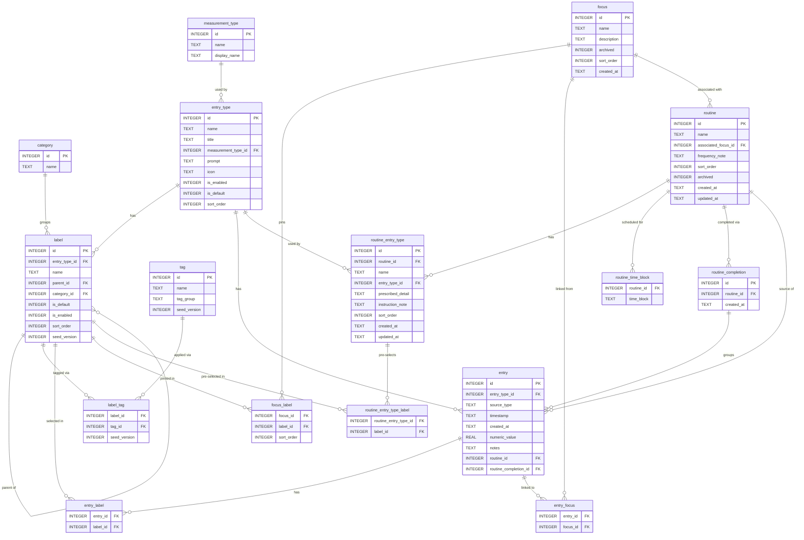

# Haven Database Schema

The source of truth is `lib/db/migrations/`. The ER diagram below reflects what is currently implemented.

```mermaid
erDiagram
    measurement_type {
        INTEGER id PK
        TEXT name
        TEXT display_name
    }

    category {
        INTEGER id PK
        TEXT name
    }

    entry_type {
        INTEGER id PK
        TEXT name
        TEXT title
        INTEGER measurement_type_id FK
        TEXT prompt
        TEXT icon
        INTEGER is_enabled
        INTEGER is_default
        INTEGER sort_order
    }

    label {
        INTEGER id PK
        INTEGER entry_type_id FK
        TEXT name
        INTEGER parent_id FK
        INTEGER category_id FK
        INTEGER is_default
        INTEGER is_enabled
        INTEGER sort_order
        INTEGER seed_version
    }

    tag {
        INTEGER id PK
        TEXT name
        TEXT tag_group
        INTEGER seed_version
    }

    label_tag {
        INTEGER label_id FK
        INTEGER tag_id FK
        INTEGER seed_version
    }

    entry {
        INTEGER id PK
        INTEGER entry_type_id FK
        TEXT source_type
        TEXT timestamp
        TEXT created_at
        REAL numeric_value
        TEXT notes
        INTEGER routine_id FK
        INTEGER routine_completion_id FK
    }

    entry_label {
        INTEGER entry_id FK
        INTEGER label_id FK
    }

    measurement_type ||--o{ entry_type : "used by"
    entry_type ||--o{ label : "has"
    entry_type ||--o{ entry : "has"
    category ||--o{ label : "groups"
    label ||--o{ label : "parent of"
    label ||--o{ label_tag : "tagged via"
    tag ||--o{ label_tag : "applied via"
    entry ||--o{ entry_label : "has"
    label ||--o{ entry_label : "selected in"

    focus {
        INTEGER id PK
        TEXT name
        TEXT description
        INTEGER archived
        INTEGER sort_order
        TEXT created_at
    }

    focus_label {
        INTEGER focus_id FK
        INTEGER label_id FK
        INTEGER sort_order
    }

    entry_focus {
        INTEGER entry_id FK
        INTEGER focus_id FK
    }

    focus ||--o{ focus_label : "pins"
    label ||--o{ focus_label : "pinned in"
    entry ||--o{ entry_focus : "linked to"
    focus ||--o{ entry_focus : "linked from"

    routine {
        INTEGER id PK
        TEXT name
        INTEGER associated_focus_id FK
        TEXT frequency_note
        INTEGER sort_order
        INTEGER archived
        TEXT created_at
        TEXT updated_at
    }

    routine_entry_type {
        INTEGER id PK
        INTEGER routine_id FK
        TEXT name
        INTEGER entry_type_id FK
        TEXT prescribed_detail
        TEXT instruction_note
        INTEGER sort_order
        TEXT created_at
        TEXT updated_at
    }

    routine_entry_type_label {
        INTEGER routine_entry_type_id FK
        INTEGER label_id FK
    }

    routine_time_block {
        INTEGER routine_id FK
        TEXT time_block
    }

    routine_completion {
        INTEGER id PK
        INTEGER routine_id FK
        TEXT created_at
    }

    focus ||--o{ routine : "associated with"
    entry_type ||--o{ routine_entry_type : "used by"
    routine ||--o{ routine_entry_type : "has"
    routine ||--o{ routine_time_block : "scheduled for"
    routine ||--o{ routine_completion : "completed via"
    routine_entry_type ||--o{ routine_entry_type_label : "pre-selects"
    label ||--o{ routine_entry_type_label : "pre-selected in"
    routine_completion ||--o{ entry : "groups"
    routine ||--o{ entry : "source of"
```

## Planned tables (not yet implemented)

| Table | Purpose |
|-------|---------|
| `anchor_activity` | Grounding activity suggestions with effort tracking |
| `anchor_tag` | Join table linking anchor activities to tags |

## Notes on specific columns

**entry.source_type** — `"log"` (timestamped, in-the-moment) or `"reflect"` (end-of-day, date-associated). Reflect mode UI is deferred; the field is captured now to avoid a future migration.

**entry.numeric_value** — used for: hours (sleep), oz/ml (hydration), energy 0–5 (Physical entries with Energy label), severity 1–5 (Physical entries with body area/whole body labels).

**label.parent_id** — self-referencing FK enabling two-level hierarchies: valence → specific emotions (Emotion), body area → symptoms/states (Physical).

**label.seed_version** — incremented when new seed rows are introduced in an app update. On app open, only rows where `seed_version > last_applied_version` are inserted (via `INSERT OR IGNORE`), so user-deleted associations are never re-applied.

**entry_type.measurement_type_id** — drives which logging form is shown. Types: `numeric` (sleep, hydration), `label_select` (food, emotion, activity), `label_select_severity` (physical).

**focus.archived** — `0` = active, `1` = archived. Archived focuses are hidden from the logging UI but preserved for historical correlation queries.

**entry_focus** — MVP enforces one Focus per entry at the app layer. The schema uses a composite PK `(entry_id, focus_id)` to remain forward-compatible if multi-focus is introduced later. App-layer code should use a delete-then-insert transaction when changing a focus association (not `INSERT OR REPLACE`).

**entry.routine_id** — nullable FK to `routine`. Set when an entry was created as part of a routine completion. `ON DELETE SET NULL` so historical entries survive if a routine is deleted.

**entry.routine_completion_id** — nullable FK to `routine_completion`. Groups all entries created in a single routine completion event. `ON DELETE SET NULL` for the same reason. Completion state per time block is derived at query time by joining `entry.routine_completion_id → routine_completion.created_at` filtered by `routine_time_block.time_block`.

**routine.updated_at** and **routine_entry_type.updated_at** — application code is responsible for keeping these current on any mutation. Mutations to child join tables (`routine_entry_type_label`, `routine_time_block`) should also update the parent `updated_at` if the change is user-visible.

**routine_completion** — intentionally has no `updated_at`; it is immutable once inserted. The `created_at` text stores the ISO wall-clock timestamp of the completion event. Application code must insert `routine_completion` first and use the returned row ID when building the entry batch.
